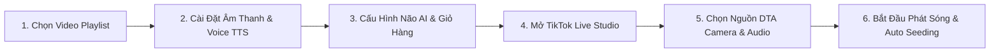

# 🚀 DTA LiveTik PRO v2.6.3 - Hệ Thống Tự Động Hóa Livestream Bán Hàng Thông Minh

<div align="center">


[](https://github.com/TruongAnh2706/DTA-LiveTik-Releases)
[](https://github.com/TruongAnh2706/DTA-LiveTik-Releases)
[](https://dta-studio.vercel.app/)

<br/>

**PHẦN MỀM TỰ ĐỘNG HÓA LIVESTREAM TIKTOK CHUYÊN NGHIỆP HÀNG ĐẦU DÀNH CHO KOC & SHOP BÁN HÀNG**  
*Tích hợp Trí tuệ nhân tạo Đa Não AI • Điều khiển Âm thanh Studio Ducking • 30 Giọng đọc Piper TTS Offline • Ghim Giỏ Hàng Tự Động • Dàn Nick Seeding Chống AFK*

---

### 🌟 THÔNG TIN BẢN QUYỀN & HỖ TRỢ KỸ THUẬT
**Phát triển bởi DTA Studio - Chủ quản: Đức Trường AI**  
📞 **Hotline / Zalo:** [0962.775.506](https://zalo.me/0962775506)  
📧 **Email:** [ductruong.onl@gmail.com](mailto:ductruong.onl@gmail.com)  
🌐 **Website:** [https://dta-studio.vercel.app/](https://dta-studio.vercel.app/)  
👤 **Facebook:** [phamductruong17](https://www.facebook.com/phamductruong17/)  
🐙 **GitHub:** [TruongAnh2706](https://github.com/TruongAnh2706)  

---

</div>

## 📑 MỤC LỤC
1. [Giới Thiệu Tổng Quan](#-giới-thiệu-tổng-quan)
2. [Tính Năng Đột Phá Trên Bản v2.6.3](#-tính-năng-đột-phá-trên-bản-v263)
3. [Kiến Trúc Kỹ Thuật (Architecture)](#-kiến-trúc-kỹ-thuật-architecture)
4. [Hướng Dẫn Cài Đặt Nhanh](#-hướng-dẫn-cài-đặt-nhanh)
5. [Quy Trình Vận Hành Livestream Chuẩn](#-quy-trình-vận-hành-livestream-chuẩn)
6. [Hệ Thống Phím Tắt & Điều Khiển](#-hệ-thống-phím-tắt--điều-khiển)
7. [Chính Sách Cập Nhật & Bản Quyền](#-chính-sách-cập-nhật--bản-quyền)

---

## 📌 GIỚI THIỆU TỔNG QUAN

**DTA LiveTik PRO** là ứng dụng máy tính (Desktop App) chuyên dụng cao cấp, giải quyết bài toán tự động hóa hoàn toàn luồng phát Livestream bán hàng trên **TikTok Live & TikTok Shop**.

Phần mềm kết hợp giữa **Giao diện Electron Hiện Đại (Dark Mode Cyberpunk Neon)** và **Động cơ Lõi Python Hiệu Năng Cao (Clean Architecture)**:
- Phát sóng video lặp vô tận độ nét cao sang **TikTok Live Studio / OBS** qua trình điều khiển ảo DirectShow độc quyền (**DTA Camera & DTA Audio**), độ trễ tiệm cận **0ms**.
- Lắng nghe sự kiện phòng Live thời gian thực (Bình luận, Thả tim, Tặng quà, Follow) bằng **TikTok Webcast Listener**.
- Tự động tư vấn sản phẩm, giải đáp thắc mắc bằng **Bộ Não AI Kép (DeepSeek V3 Cloud & Qwen Local)**.
- Trả lời comment khách hàng bằng **30 Giọng nói Piper TTS Offline chuẩn tiếng Việt**, tích hợp **Studio Vocal EQ** và cơ chế **Audio Ducking** mượt mà không ngắt quãng.
- Tự động ghim giỏ hàng định kỳ, quản lý dàn nick seeding nuôi tương tác, chống đứng hình / AFK TikTok Live Studio.

---

## ✨ TÍNH NĂNG ĐỘT PHÁ TRÊN BẢN v2.6.3

### 1. 🎚️ Bộ Trộn Âm Thanh Tự Động (Auto Audio Ducking) Mượt Mà
- **Hạ âm lượng thông minh (Fade-out):** Khi có bình luận của khách hàng và AI bắt đầu phát giọng nói trả lời, âm lượng của Video Live sẽ tự động giảm dần xuống 0% trong vòng **350ms**.
- **Giữ nhịp phòng live:** Nhạc nền BGM vẫn được duy trì êm ái, đảm bảo phòng live không bị khoảng lặng ngắt quãng.
- **Khôi phục âm lượng êm ái (Fade-in):** Ngay khi giọng đọc kết thúc, âm lượng Video Live tự động tăng dần trở lại mức ban đầu trong **800ms**.

### 2. 🎙️ Hệ Thống Voice TTS 30 Giọng Đọc Piper AI Cao Cấp
- **Phân nhóm Nam / Nữ rõ rệt:** Giao diện phân loại 2 tab màu sắc trực quan (Nam xanh dương neon, Nữ hồng tím neon) kèm avatar nhận diện đặc thù cho từng nhân vật giọng đọc.
- **30 Giọng đọc offline mượt mà:** Bao gồm đầy đủ các giọng đọc tiếng Việt truyền cảm (Minh Quang, Ban Mai, Thu Hà, Ngọc Huyền, Nam Khánh, v.v.).
- **Mở rộng 300 ký tự:** Tối ưu hóa giới hạn ký tự câu trả lời lên đến **300 ký tự**, cho phép AI phản hồi đầy đủ thông tin chương trình khuyến mãi và công năng sản phẩm.

### 3. 🎛️ Bàn Điều Khiển Studio Vocal EQ Thời Gian Thực
- **Pitch Shift (Cao độ):** Tăng giảm từ -12 semitone đến +12 semitone, dễ dàng biến hóa giọng trầm ấm hoặc thanh thoát.
- **Speed Rate (Tốc độ):** Điều chỉnh tốc độ nói từ 0.7x đến 1.5x phù hợp với từng nhịp độ livestream.
- **Bass & Treble Boost:** Tăng cường âm trầm ấm áp hoặc âm cao trong trẻo, sắc nét.
- **Studio Reverb:** Hiệu ứng tiếng vang không gian studio chuyên nghiệp.
- Mọi tinh chỉnh EQ được áp dụng trực tiếp lên giọng đọc hiện tại mà không cần nạp lại mô hình.

### 4. 📖 Bảng Từ Điển Phát Âm & Từ Lóng Livestream (Slang Dictionary)
- Tự động chuẩn hóa từ ngữ viết tắt và từ lóng mạng trước khi đọc giọng nói:
  - `ib` / `inbox` ➡️ *nhắn tin*
  - `freeship` / `fs` ➡️ *miễn phí giao hàng*
  - `cmt` / `comment` ➡️ *bình luận*
  - `sp` ➡️ *sản phẩm*
  - `giá sốc` / `deal hời` ➡️ đọc chuẩn ngữ điệu bán hàng tiếng Việt.
- Cho phép người dùng tùy chỉnh và thêm bớt từ vựng theo ngành hàng riêng.

### 5. 💾 Lưu Trữ Bền Vững 100% Cài Đặt (Zero-Reset Persistence)
- Tự động ghi nhớ toàn bộ thiết lập ở tất cả các tab:
  - Thiết bị âm thanh truyền đã chọn (CABLE Output, Headphone, Virtual Audio...).
  - Cấu hình Voice TTS (Giọng, Tốc độ, Âm lượng, EQ).
  - Kịch bản ghim sản phẩm & thời gian lặp.
  - Danh sách tài khoản Chrome, proxy và thông số nuôi nick.
  - Tỷ lệ khung hình và vị trí tọa độ đo F8.
- Khởi động lại ứng dụng là toàn bộ cài đặt sẵn sàng ngay lập tức.

### 6. 📐 Đa Tỷ Lệ Khung Hình Đồ Họa (Multi-Aspect Ratio)
- Chuyển đổi nhanh 1 chạm giữa các tỷ lệ:
  - **9:16 (Dọc):** Tối ưu hóa chuẩn Livestream TikTok trên điện thoại di động.
  - **16:9 (Ngang):** Phù hợp phát sóng màn hình máy tính, thiết bị gaming, OBS.
  - **1:1 (Vuông):** Phù hợp luồng giới thiệu chi tiết sản phẩm.

### 7. 🧠 Đa Não AI Linh Hoạt (Hybrid AI Brain Orchestrator)
- **DeepSeek V3 (Cloud AI 671B MoE):** Trí tuệ nhân tạo siêu thông minh, xử lý ngôn ngữ tự nhiên xuất sắc, hiểu ngữ cảnh giỏ hàng và chốt đơn đỉnh cao.
- **Qwen Local AI (Offline):** Chạy trực tiếp trên máy không cần internet, bảo mật 100% dữ liệu.

### 8. 🌐 Trình Quản Lý Dàn Chrome Farmer & Seeding Chống AFK
- **Subnet C Detector:** Rà soát phát hiện các tài khoản dùng chung dải IP mạng (/24) để cảnh báo tránh thuật toán quét của TikTok.
- **Quy trình làm ấm tự nhiên (Hybrid Auto-Warming):** Tự động lướt For You, xem video theo từ khóa ngành hàng, thả tim, lưu bài trước khi vào phòng live.
- **Chống đứng hình TikTok Live Studio:** Tự động bấm vẫy tay **Alt+H** chào người xem mới, chống thuật toán TikTok đánh giá kênh treo máy AFK.

---

## 🏗️ KIẾN TRÚC KỸ THUẬT (ARCHITECTURE)

```
dta-autolive/
├── assets/                    # Biểu tượng, âm thanh, thương hiệu DTA Studio
├── drivers/                   # Trình điều khiển ảo DirectShow (DTA Camera & DTA Audio)
├── electron/                  # Giao diện Electron High-Tech Dark Mode (Frontend)
│   ├── renderer/              # Giao diện điều khiển (HTML5, Neon CSS, JavaScript)
│   ├── main.js                # Main Process Electron & Quản lý IPC
│   └── ota_updater.js         # Động cơ tự động cập nhật OTA từ GitHub Releases
├── models_repository/         # Kho mô hình 30 giọng đọc Piper TTS Offline (.onnx)
├── src/                       # Lõi xử lý nghiệp vụ Python (Clean Architecture)
│   └── dta_autolive/
│       ├── domain/            # Máy trạng thái hữu hạn (FSM) và thực thể dữ liệu
│       ├── application/       # Sắp xếp timeline phát sóng và điều phối sự kiện
│       ├── infrastructure/    # SoftCam, Audio Mixer, Ducking Engine, Voice TTS, AI Brains
│       └── launcher/          # Máy chủ Backend API WebSocket Service (Port 8765)
├── tests/                     # Hệ thống kiểm thử tự động 183 Unit & Integration Tests (100% Pass)
├── pyproject.toml             # Quản lý dependencies và cấu hình Ruff / Mypy / Pytest
└── publish_release.py         # Kịch bản phát hành tự động lên GitHub Releases
```

---

## 🚀 HƯỚNG DẪN CÀI ĐẶT NHANH

### Cách 1: Sử Dụng Bản Cài Đặt Sẵn (Khuyên dùng cho người dùng)
1. Tải bản cài đặt mới nhất tại: **[GitHub Releases](https://github.com/TruongAnh2706/DTA-LiveTik-Releases/releases/latest)**
   - Tệp cài đặt: `DTA_LiveTik_Setup_v2.6.3.exe` (hoặc bản Portable `DTA_LiveTik_v2.6.3_Portable.zip`).
2. Nhấp đúp vào tệp `.exe` để tiến hành cài đặt. Phần mềm tự động nạp trình điều khiển **DTA Camera & Audio Virtual Devices**.
3. Mở ứng dụng **DTA LiveTik PRO** từ màn hình Desktop.

### Cách 2: Chạy Từ Mã Nguồn (Dành cho Lập trình viên)
Yêu cầu: **Python 3.11+**, **Node.js 20+**, **Git**.

```bash
# 1. Clone mã nguồn
git clone https://github.com/TruongAnh2706/DTA-LiveTik-Source-Code.git
cd DTA-LiveTik-Source-Code

# 2. Cài đặt thư viện Python
pip install -e .[dev]

# 3. Cài đặt dependencies Node.js
npm install

# 4. Kiểm tra chất lượng code (Quality Gate)
python -m ruff check src/
python -m mypy src/
python -m pytest tests/unit/

# 5. Khởi chạy ứng dụng ở chế độ Development
npm run dev
```

---

## 🎬 QUY TRÌNH VẬN HÀNH LIVESTREAM CHUẨN



1. **Bước 1:** Tại tab **Phát Sóng**, chọn thư mục chứa video bán hàng của bạn. Chọn tỷ lệ mong muốn (9:16 hoặc 16:9).
2. **Bước 2:** Tại tab **Âm Thanh & Voice TTS**, chọn thiết bị âm thanh truyền (ví dụ: `CABLE Input (VB-Audio Virtual Cable)` hoặc card âm thanh phụ). Chọn giọng đọc AI (Nam/Nữ) và tùy chỉnh EQ theo ý thích.
3. **Bước 3:** Nhập TikTok Username của phòng live vào mục **TikTok Webcast Listener** và bấm **Kết Nối** để theo dõi comment thời gian thực.
4. **Bước 4:** Bật **TikTok Live Studio**, thêm nguồn Camera chọn **DTA Camera**, thêm nguồn Micro chọn **CABLE Output** (hoặc thiết bị âm thanh bạn đã chọn).
5. **Bước 5:** Bấm **Bắt Đầu Phát** trên DTA LiveTik PRO. Hệ thống sẽ tự động phát video, tự động trả lời comment bằng giọng AI, tự động hạ nhạc (Auto Ducking) và tự động ghim giỏ hàng!

---

## ⌨️ HỆ THỐNG PHÍM TẮT & ĐIỀU KHIỂN

| Phím Tắt | Tác Vụ | Chi Tiết Chức Năng |
| :---: | :---: | :--- |
| **F8** | **Đo Tọa Độ Live Studio** | Đo chính xác vị trí nút bấm Tắt Live / Ghim sản phẩm mà không sợ xung đột |
| **Alt + H** | **Vẫy Tay Chống AFK** | Giả lập thao tác vẫy tay chào người xem trên TikTok Live Studio |
| **Space** | **Tạm Dừng / Tiếp Tục** | Tạm dừng hoặc tiếp tục luồng video phát sóng |
| **⏭ Next** | **Chuyển Video Tức Thì** | Chuyển bài mượt mà ngay cả khi video đang tạm dừng hoặc đang phát |

---

## 🛡️ CHÍNH SÁCH CẬP NHẬT & BẢN QUYỀN

- **Bản quyền sở hữu:** Phần mềm được nghiên cứu, thiết kế và phát triển độc quyền bởi **DTA Studio** - Giám đốc kỹ thuật: **Đức Trường AI**.
- **Cập nhật OTA:** Tự động thông báo và tải các bản vá sửa lỗi hoặc nâng cấp tính năng mới nhất từ máy chủ GitHub Releases.
- Mọi hình thức sao chép mã nguồn, phát hành lại không có sự đồng ý của tác giả đều là vi phạm quyền sở hữu trí tuệ.

<div align="center">

---

**DTA STUDIO - KIẾN TẠO TƯƠNG LAI TỰ ĐỘNG HÓA AI**  
*Mọi thắc mắc và yêu cầu hỗ trợ kỹ thuật, vui lòng liên hệ Zalo: **0962.775.506** (Đức Trường).*

</div>
